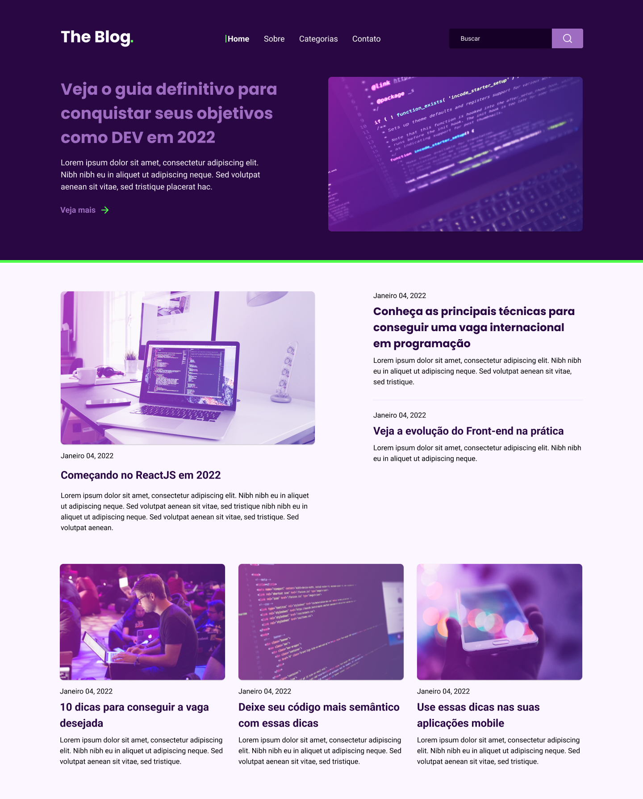

# RocketShoes

## Projeto 💻
Projeto de um desafio da Rocketseat de desenvolver uma homepage para um blog.

## Layout 🔖
Segue abaixo o layout deste projeto:
- [Figma](https://www.figma.com/file/sHlN5DiHNGuzXubRJNPvbn/DD-%2F-RocketBlog-(Copy)?node-id=312-152&t=jEIB5ezQb2es1NRF-0)

## Instalação 🛠
Siga esses passos para instalar o repositório na sua máquina:
1. Rode `git clone https://github.com/marcosfmd/rocket-blog` para fazer um clone desse repositório.
2. Abra o arquivo HTML.

## Tecnologias 🚀
As tecnologias utilizadas neste projeto são:
- HTML
- CSS
- Google Fonts
- Git e GitHub

## Deploy 🚀

- [Projeto hospedador](https://marcosfmd.github.io/rocket-blog)

## Créditos ❤️
Feito por [Marcos Felipe](https://github.com/marcosfmd/).